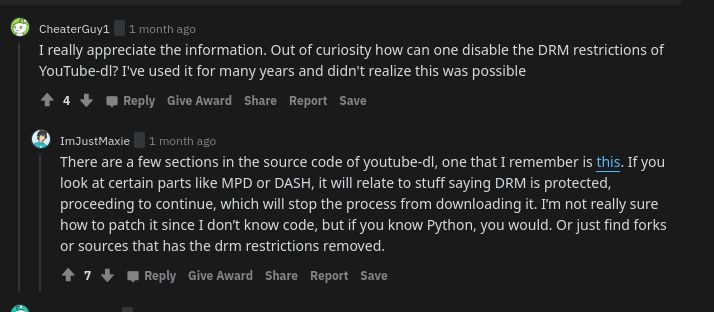

# Piracy


# **Table of Contents**
- General
- Guides
    - text + video tutorial on how to rip from Ama***
    - A beginners guide to video game piracy.  by scary with help from midnyte.
- Trackers & Websites
- Apps

---


## General


- [Reddit Megathread](https://www.reddit.com/r/Piracy/wiki/megathread/)
    - [tools](https://www.reddit.com/r/piracy/wiki/megathread/tools)
- Awesome Piracy List:
    https://github.com/Igglybuff/awesome-piracy
- Awesome Data Hoarding:
    https://github.com/simon987/awesome-datahoarding
- Mega Warez List:
    https://github.com/CHEF-KOCH/Warez/blob/master/README.md

- Team Drives
    - GitHub Repos for GDrive Index
        - https://github.com/Kshitijchoudhry/Drive-Index
        - https://github.com/LeeluPradhan/G-Index
        - https://github.com/kulokenci/goindex-drive
        - https://github.com/alx-xlx/goindex
        - https://github.com/maple3142/GDIndex
        - https://github.com/K-E-N-W-A-Y/goindex
        - https://github.com/ParveenBhadooOfficial/BhadooDriveIndex
        - https://github.com/420tushar/krat0si-ndex
        - Easy Deployments
            - https://goindex.glitch.me/
            - https://smth.msxd.workers.dev
            - https://goindex.teamsdrives.workers.dev/1:/
            - https://goindex-quick-install.glitch.me/

    - Get free ccsf/swccd team drives(shared drives) every 24 hours here:
        ```
        Ccsf: https://teamdrive.mfoxx.workers.dev
        Swccd: http://leon.educationhost.cloud
        (The first column is the name of your new team drive. The second column is your gmail address.)
        (Feel free to share these links to anyone!!! Let more people to know about them!)
        **Here is another bot that generates ccsf/swccd team drives randomly: @HK_ROBOT**
        Type /teamdrive and then your email to generate one.
        E.g.:
        /teamdrive example@gmail.com
        ```

    - https://free-drive.orangesfor.me/   (Gives CCSF)
    - http://leon.educationhost.cloud/   (SWCCD)
    - https://www.teamdrive.workers.dev/  (SWCCD) - Not working now
    - https://gd.zxd.workers.dev/   Some Yexyesxx domain
    - https://teamdrive.xcpx.workers.dev/  (SWCCD) - Not working now
    - https://gdrive.zppcw.cn/  sheffield.ac.uk
    - https://ucla.ur.workers.dev - ucla.edu
    - https://iuj.ur.workers.dev/ - iuj.ac.jp
    - https://ucla.ur.workers.dev - ucla.edu
    - https://iuj.ur.workers.dev/ - iuj.ac.jp
    - https://ucla.ur.workers.dev (https://ucla.ur.workers.dev/)/
    - https://gd.zxd.workers.dev/  this gives td from aims
    - Getting from some UK university https://www.sheffield.ac.uk/
    - https://gdrive.zppcw.cn/


- Apply for Office 365 Education Edition : 
    - Student version : https://signup.microsoft.com/signup?sku=student 
    - Teacher Edition : https://signup.microsoft.com/signup?sku=faculty 
    - Temporary mailbox for O365 : 
        - http://onedrive.readmail.net 
        - http://od.obagg.com 
        - http://mail.hrka.net 
        - http://xkx.me 
        - https://t.odmail.cn 
        - https://xlu.me 
        - https://m.mzr.me 
        - http://24mail.chacuo.net (Office 365 A1 Plus subscription)


- Tools for Modding
    - Jasi Patcher: https://www.mediafire.com/file/ee8g110ee9z6mmi/Jasi_Patcher_v4.8.apk
    - Lucky Patcher: https://www.mediafire.com/file/n4a5yb9a9nr8cqh/LP_Installer-v8.5.2_build_1612.apk
    - Mobilism: https://forum.mobilism.org/viewforum.php?f=398

- Temporary Gmail Accounts:
    - http://gmailnator.com (best)
    - http://storegmail.com

- SMS
    - try these
        - http://www.receive-sms-online.info
        - http://receive-a-sms.com
        - https://www.textmagic.com/free-tools/receive-free-sms-online
        - http://hs3x.com
        - http://receivesmsonline.in
        - http://www.receive-sms-now.com
        - http://receivefreesms.net
        - http://receivesmsonline.com

    - GET PERSONAL NUMBER FOR RECEIVING SMS
        1. Twilio.com 
        2. Textnow.com 
        3. Countrycode.org 
        4. Wp.pinger.com 
        5. Textmagic.com 
        6. Esendex.co.uk - (It's easy to get a trial period using a virtual number by fast registration, the package includes 25 free messages, the restriction of use in 7 days.No credit card is required.You can be counted for a personal number!) 
        7. Burstsms.com.au - (Similar service as the previous one, fast registration, the probe includes 14 days You do not need a credit card, so you can count as a personal number!) 
        8. Directsms.com.au - (You register, you get a free 30-day trial version Business sms. Personal Wirth.number!)
        9. Vumber.com - (Register, receive a 14-day trial version.) Personal PUBLIC NUMBER FOR RECEIVING SMS➖
        1. Receive-sms-online.info 
        2. Receivefreesms.net 
        3. Sms-receive.net 
        4. Receive-a-sms.com 
        5. Hs3x.com 
        6. Receive-sms-now.com - (There are Russian numbers) 
        7. Smsreceivefree.com 
        8. Receivesmsonline.com 
        9. Getsms.org - (Рус.номера) 
        10. Tempsms.ru - (Rus.number) 
        11. Numberforsms.com - (There are Russian numbers) 
        12. Sonetel.com 
        13. Smska.us - (Rus.number) 
        14. Sellaite.com 
        15. Sms.ink - (Rus.numera) 
        16. Proovl.com 
        17. Onlinesim.ru 
        18. Zadarma.com - (There are Russian numbers)
        19. Smsc.ru - (You need to register, there are Russian and Ukrainian numbers) 
        20. Freevirtualnumber.skycallbd.com 
        21. Getfreesmsnumber.com 
        22. Receive-smsonline.net - Yearly design 
        23. Receivefreesms.com 
        24. Receivesmsverification.com 
        25. Sms-online.co 
        26. Ireceivesmsonline.com 
        27. Receive-sms-online.com - (There are a number of scores) 
        28. Receive-sms-free.com 
        29. Esendex.com.au - (Registration required) 
        30. Receivesmsonline .in 
        31. Mytrashmobile.com 
        32. Receivesmsonline.me 
        33. Anon-sms.com 
        34. Mfreesms.com 
        35. Spryng.nl - (You need to register) 
        36. Smsreceiveonline.com 
        37. Smsget.net - (Megaphone and Beeline)


- [crawler websites](https://www.reddit.com/r/Piracy/comments/i4zaq4/why_do_i_get_this_feeling_not_many_new_pirates/)
    - ```
        Web crawlers are bots that search the web and index the sites in their databases.
        There are people who made great crawlers meant for piracy that take torrents from public torrent trackers. You find everything in one place. Some websites are even ad free. A big bonus is also you get torrents from tracker sites that require you to register (not a problem... until you stumble upon a Russian torrent site and you don't know Russian).
        *cough* Knaben database @ knaben.xyz *cough*
        This is probably the biggest free torrent crawler that gets torrents from public trackers. It just works. I downloaded terabytes of music and movies thanks to the wonderful people who made this. I just don't like having to login to websites to have access to more music, especially because some websites have stupid rules when it comes to personalising your profile (looking at you, soundpark).
        ```

- Use colab to extract RAR files on drive

- [Rclone-Guide-for-Beginners-04-15](https://telegra.ph/Rclone-Guide-for-Beginners-04-15)
- [[Guide] How to set up Docker containers to automatically download any TV show or movie](https://www.reddit.com/r/Piracy/comments/cuzmro/guide_how_to_set_up_docker_containers_to/)
- [Widewine L3 Decryptor](https://github.com/tomer8007/widevine-l3-decryptor/tree/ed8a97745c69b8cc0fc7f59cec9474b216b49e16)
- [find programming courses](https://www.reddit.com/r/Piracy/comments/i5pguj/where_would_i_find_programming_courses/)
- [pirated Android games source](https://www.reddit.com/r/Piracy/comments/hx71y9/trusted_pirated_android_games_source/)

- [pirate cinema](https://craphound.com/pc/download/)
    - Pirate Cinema is a novel by Cory Doctorow. It was released in October 2012. The novel is licensed under the terms of Creative Commons BY-NC-ND license and is available free on the author's website. The novel is set in a dystopian near-future Britain where the government is effectively controlled by media corporations
- [The Right to Read, by GNU Project](https://www.gnu.org/philosophy/right-to-read.en.html)

- https://github.com/Th3-822/rapidleech
    - And transloaders

- 
    - [This](https://github.com/ytdl-org/youtube-dl/blob/master/youtube_dl/extractor/common.py)


## Guides


<details><summary>Android APK modding tutorial</summary>
<p>

- Android APK modding tutorial
    ```
    Results:
    How to make Your Own APK Mods for Android Games ... (https://www.youtube.com/watch?v=CS9HHzzlOQA)
    Enable Cheats, Change Stuff and Hack all the Android Games. Tutorial: https://hackerbot.net/tutorials/330 ...

    [Guide:] The Definitive APK Modding and Them… | Android ... (https://forum.xda-developers.com/showthread.php?t=2295002)
    May 25, 2013 · In 2017 there are a few different ways you can theme a ROM. Apktool, which can decompile an .apk allowing you to modify your own .xmls and .

    TUTORIALS | Platinmods.com - Android & iOS MODs, Mobile Games & Apps (https://platinmods.com/forums/tutorials.10/)
    As the name says, here you can find & share knowledge about modding =) ... Tutorial BASICS ABOUT ANDROID APK MODDING IN GENERAL | LEARN ...

    Tutorial - Android Modding Tutorial Part 1 | Guided Hacking (https://guidedhacking.com/threads/android-modding-tutorial-part-1.13124/)
    Decompile the apk with apktool or just open it with WinRar or any other ZIP programm. APK Files are like ZIP Files. And extract our lib from \lib\ ...

    Android Modding University | Sbenny's Forum (https://forum.sbenny.com/forums/android-modding-university.68/)
    Jan 2, 2018 · Tutorial How to Create MOD MENU for | il2cpp.so | and other native android ... to add Custom Toast Messages, Dialogs & Splash Screens in MOD APK Files.

    Game Modding Tutorials - Libre Boards (https://boards.libre.io/forums/game-modding-tutorials.35/)
    Tutorials for reversing and hacking iOS & Android games. ... Apk Editor 1. Dowload and Install APK Editor 2. Select "Use an apk File" 3. Search and click on your ...

    Android Apk Modding Tutorial #1 - Getting Started - video ... (https://www.dailymotion.com/video/x6fsu2g)
    Part 1 in the . Next part will be a tutorial on modifying set/get functions in non-unity games with IDA Pro!\rPart ...

    Learning how to mod and mod apk files? | Android Republic ... (https://androidrepublic.org/threads/learning-how-to-mod-and-mod-apk-files.29581/)
    May 14, 2017 · Do you know any other website where they provide more in depth tutorial how things are working? Click to expand... no i dont and i am not a ...

    Tutorials | Android Republic - Android Game Mods (https://androidrepublic.org/forums/tutorials.32/)
    How to mod Love Live All Stars? Channy155 · Mar 6, 2020. 1. Replies: 1. Views: 142. Mar 6, 2020 · Miyoumu · Miyoumu · DanYal. How to connect a mod apk to ...

    TUTORIAL | Best Site Hack Game Android - iOS Game Mods - BlackMod.Net (https://blackmod.net/forums/4/)
    Hacking, cheating & general Android, iOS tutorials here! ... TUTORIAL Shadow fight 3 how to install mod apk . smdozk; Jan 1, 1970. Replies: 3. Views: 512.
    ```

</p>
</details>


<details><summary>text + video tutorial on how to rip from Ama-z-o-n</summary>
<p>

- [text + video tutorial on how to rip from Ama-z-o-n](https://www.reddit.com/r/Piracy/comments/kmodia/improved_text_video_tutorial_on_how_to_rip_from/)

    ```
    [VIDEO](https://streamable.com/dk4hxi)

    TEXT TUTORIAL:

    This assumes you have already installed the Widevine L3 Decryptor and mp4decryptor.

    Step 1: Find a TV show or movie you want to download and open the inspect element before clicking on it.

    Step 2: Start streaming the video with the inspect element open. Preferably, you should be preservidownloaded both encrypted filesng all network logs (you can find it here, in the settings)(https://imgbox.com/YXx8Eis0)

    Step 3: In the network tab, search for "mpd" (should look something like [this](https://imgbox.com/WszKGkbL)). Right click on one of them, and copy the response [image](https://imgbox.com/e5x49lIw). Paste this into something like notepad++.

    Step 4: Search for "cenc:default_KID=". For EACH(!!) result, copy what is inside the quotation marks and paste it somewhere at the top of your document. I recommend first prettifying the xml/html so it is easier to read.

    Video of me doing steps 3 and 4: https://streamable.com/mrmp2m

    (Remove the dashes in the KID or the decompression will not work.)

    Step 5: Go to the console tab, and find each key that matches a KID you found in the MPD.

    In the video, I found CF1F98F85CB74D9B8A7D5576D126FFDB and 743FB7D3CDE3424B932EE841983F3A20, so I would look for those and then copy the keys from a saved .log file.

    [Video](https://streamable.com/p7m6n9)

    Step 6: Now that you have a key and KID (in my case I had 2 pairs) find your video and audio by searching for it. I want to find the highest quality for each, so I will increment until I dont get a response.

    [Video](https://streamable.com/ri0kzb) (only shows audio download [with incrementing], video is the same process but just search for the video instead of audio)

    Step 6: Now that you have downloaded both encrypted files, in powershell or command prompt type

     (path to mp4decrypt.exe) --key (KID):(KEY) "sourcefile.mp4" "destinationfile.mp4"

     Consider adding mp4decrypt to PATH. Repeat this process with different KIDs and keys (dont mix and match the keys!) if the conversion did not successfully decrypt the file. (You might be able to use the same KID and key for both files)

    Step 7: Combine them in mkvToolnix.

    __________

    Answers to common questions

    Thanks!

    ```
</p>
</details>


<details><summary>A beginners guide to video game piracy.  by scary with help from midnyte.</summary>
<p>

- A beginners guide to video game piracy.  by scary with help from midnyte.
    ```
    Before we begin, here are some useful tools:

    uBlock Origin - The best adblocker out there: https://ublockorigin.com/

    7-zip - for extracting files - better than WinRar: https://www.7-zip.org/

    IDM - A download manager as an alternative to downloading in browser (optional) 

    Jdownloader 2 - A download manager for downloading many files in bulk: https://jdownloader.org/jdownloader2

    qBitorrent - The best torrent client for personal use: https://www.qbittorrent.org/

    td.fastio.me - A tool for creating free google team drives: http://td.fastio.me/ (Always use an alt)

    https://www87.zippyshare.com/v/1g2f0lrj/file.html - A google colab script that downloads torrents directly to google drive.
    I would only use this if you absolutely can't torrent, because it doesn't give back to the community at all. To use it, download the script, then upload to google drive, then click open with google colaboratory.  
    ------------------------------------------------------------------------------------------------------------

    Lets start with how to torrent:

    Torrenting is using the bittorent protocol to share files. The BitTorrent protocol is a p2p file sharing protocol, and it requires no server, it uses other people uploading for you to be able to download. Since Piracy is illegal and different countries have different torrenting laws you may need to check if you need a vpn to torrent files, the reason you need a vpn to torrent files and not to direct download, is because direct downloading is just you and the server, while in the BitTorrent protocol everyone can see your i.p. I will link to a great essay about this topic here:
    https://www.reddit.com/r/Piracy/comments/huwyfi/what_people_get_wrong_about_copyrights_vpns_and/
    ---------------------------------------------------------------------------------------------------------------------------
    Setting up qBitorrent:

    1st of all, I would recommend binding your vpn to qBittorrent. You can do this by going to options > advanced > network interface and setting it to your vpn's interface.

    I would also recommend turning off rate limit to uTP protocol, you can do this in options > speed.

    This video is pretty good for setting up qBit: https://www.youtube.com/watch?v=do0y_Z_lPU0

    ----------------------------------------------------------------------------------------------------------------------------

    Downloading torrents:

    I'm gonna use a scene release from rarbg.to to demonstrate.

    If a torrent has more seeders, it will be faster 99% of the time, the seeders are normally the green number.

    I prefer .torrent files over magnet links because it skips the retrieval of metadata, but it is your choice.

    Start your vpn before starting download if needed.

    Magnet Links:
    (make sure to disable webtorrent on your browser if that is an option)
    On the site you are downloading from, there should be a magnet icon or a magnet download button, click the icon/button and if you have your torrent client installed, there should be a popup asking you what app you want to open this link with,Just click qBitorrent and check the box to always use qBitorrent to open magnet links. Choose your destination folder in qBitorrent and then the download should start! Make sure to seed and don't hit and run!

    .torrent files: 

    On the site you are downloading from there should be a "torrent download" or a button that looks like a file. Once you downloaded the .torrent file, you just open it with qBitorrent, choose your destination folder, and then the download should start! Make sure to seed and don't hit & run!
    ----------------------------------------------------------------------------------------------------------------------------

    Scene Releases:

    Scene releases are the original way to download pirated games. They are in .iso format normally or they are seperated into many .rar files. You can find scene releases on many sites, but my go to is rarbg.to for torrenting and ovagames.com & scenegames.to for ddl. (Although scenegames also has torrents occasionally.) 

    rarbg: Click the games category on the left, then search for the game that you would like. Then click on the post, and refer to the torrenting section. Once the iso is downloaded, double click it to mount it, then run the setup. Then copy everything from inside the "scene group name" folder in the iso and paste it into the install directory. Then enjoy your game!

    ovagames: Search for the game you would like on the top right, then click the post with your game. Scroll down a bit and click on the "link download" tab. Then choose your file hoster of choice, The best file hoster is google drive so always go for that if available. Once you click on your file hoster if choice it should bring you to a filecrypt.co link, for the captcha you have to click the circle that is not full. Then, you will see a list of parts, click on each part and download them all to the same folder. Once they are all downloaded, select them all and right click, then hover over 7-zip and click "extract here". Once it is done extracting, double click the iso to mount it, then run the setup. Then copy everything from inside the "scene group name" folder in the iso and paste it into the install directory. Then enjoy your game! (note, ovagames also hosts elamigos repacks, but I would recommend just downloading a repack from dodi/fitgirl/xatab instead.)

    scenegames: Search for the game you would like in the search bar on the top, once you see your game, choose whether you want to download or torrent on the right (torrent is unavailable sometimes) if you click torrent it downloads a .torrent file and you can just refer to the torrenting section. If you click download it shows a list of hosters, I would always recommend zippyshare, and I will be using it for this tutorial, once you have clicked zippyshare, click "Copy links to clipboard" and open jdownloader. Once jdownloader is open, click the linkgrabber tab, right click on any empty space and click add new links, then paste all of the links and choose your directory, make sure to disable auto-extract if it's not already disabled, click continue, and once the linkgrabber is done grabbing links you can click "start all downloads" in the bottom right. Once all the files are downloaded you can go the directory and select all the files > right click > 7-zip > extract here. Then double-click the iso and run setup. Then copy everything from inside the "scene group name" folder in the iso and paste it into the install directory. Then enjoy your game!

    Links:

    https://scenegames.to/
    http://rarbg.to/
    https://ovagames.com/
    ---------------------------------------------------------------------------------------------------------------------------

    Repacks:

    Repacks are pirated games that are compressed for people with worse internet or people who don't want to download more than they have to. Some repackers I can recommend are Masquerade, Xatab, Dodi, Fitgirl, ARTEMiS, and CPG.

    Masquerade: Search for the game that you would like, click the post, and click the "masquerade pastebin" option under downloads. Go to the decryption server linked in the pastebin and follow this guide: https://telegra.ph/How-to-download-files-06-01 (Replace the pirated.me or drive.fitgirl-repacks.site with https://drive.masquerade.site/)

    Once you have copied the files to your drive, download them separately and to the same folder and select all the files with the .00x extension, then right-click > 7-zip > Extract here. Once the files are extracted you can verify the files' integrity with the "verify.exe" (optional) or run the setup & enjoy your game!

    Xatab (website is in russian): Search for the game that you would like in the search bar at the top, click the post with your game, then scroll down and click the big green "torrent" button. Then follow my steps in the torrent section. Once the files are done downloading, run the setup & enjoy your game!

    Dodi: Search for the game that you would like, then click the post with your game. If you're downloading with torrent, click the torrent button for your game and download the .torrent file from the file hoster, but if you would like to download from google drive click "gdrive" and go through the link shortener, then follow this guide https://telegra.ph/How-to-download-files-06-01 (Replace the pirated.me or drive.fitgirl-repacks.site with https://www.game-repack.site/drive/) 

    Once you have copied the files to your drive, download the files separately and to the same folder. Once they are downloaded select all the .rar files and right click > 7-zip > extract here. After they have been extracted you can run setup & enjoy your game!

    ARTEMiS: Search for your game, click on the post with your game, then scroll down a bit and click "Google Drive" under download mirrors. Then follow this tutorial https://telegra.ph/How-to-download-files-06-01 and use https://pirated.me/drive/ as the decryption server. 

    Once you have copied the files to your drive, download the files separately and to the same folder. Once they are all downloaded run setup & enjoy your game!

    FitGirl: Search for your game in the top right search bar, then click the post with your game, then scroll down a bit to the "Download Mirrors" section. If you would like to torrent you can choose 1337x, rutor, and tapocheck and follow the torrent section. If you would like to direct download you can choose any of the file hosters, To download from google drive click the link that says "Uploaded by hermietkreeft" and use this guide to download https://telegra.ph/How-to-download-files-06-01
    (Replace the pirated.me or drive.fitgirl-repacks.site with hermietkreeft.site)(make sure you copy your language pack) 

    Once you have copied the files to your drive, download the files separately and to the same folder, Once they are all downloaded select all the .rar files and right click > 7-zip > extract here. After they are extracted, run the verify bin files executable to check if the files are all intact. After that run setup, check the 2gb ram limit if you have 8gb ram or under, and enjoy your game!

    CPG: Search for your game in the search bar on the right, click the post with your game, scroll down a bit and click the button/link that says "click here to visit=>Google Drive". After clicking on that a google drive windows should open, follow the prompts to download the .7z file (separately and to the same folder if multiple) then select all of the .7z files > right click > 7-zip > extract here. Then run setup & enjoy your game!

    WARNING: TURN OFF ANTIVIRUS WHILE INSTALLING REPACKS TO AVOID ERRORS.
    YOU CAN DELETE THE INSTALLATION FILES AFTER THE REPACK IS INSTALLED

    Links: 
    https://masquerade.site/
    https://t4.xatab-repack.com/
    https://dodi-repacks.site/
    https://artemis-repacks.site/
    https://fitgirl-repacks.site/
    https://cpgrepacks.site/
    ----------------------------------------------------------------------------------------------------------------------------

    CS.RIN.RU GUIDE BY MIDNYTE

    First things first we'll need to make an account so we can use download links.
    Once you've done that we'll need to search for a game we want. I'm going to use Curse of the Dead Gods.
    Upon searching it brings up a bunch of different threads so I will use ctrl + f and search "Curse of the Dead Gods."
    There is a steam content sharing thread and a Info thread. Click on the info thread.
    The original post will have information on the game and possibly information about cracks and game files however, Curse of the Dead Gods does not.
    We'll go to the latest page to look for the latest files of the game and promptly download the latest build
    You may be redirected to a steam content sharing thread so just download from one of the listed mirrors.
    These are just clean files so we'll need to obtain a crack. For this game we'll need to use a steamstub remover.
    In most cases you can find a premade crack with no configuring needed and if there is one you can stop here and apply the crack, however you'll need a fixed .exe for this game and since .exe's change when a game is updated there is no up-to-date crack posted on the thread.
    To remove steamstub we're going to be using a program called steamless, it's very user friendly and has a GUI.
    To obtain it just search steamless on cs.rin.ru and look for the thread of it.
    Download it and launch it with steamless.exe then just select the game's .exe under file to unpack and click unpack file.
    A unpacked.exe will be in your game directory and you can now launch the game from the .exe!
    In most cases you will need to apply a steam emu (which you can read about on cs.rin.ru) however this is a unique case and we'll only need a fixed .exe.
    If you have any more questions about cs.rin.ru feel free to ask in this thread or ask on cs.rin.ru as the community is very friendly.
    Happy Pirating!

    Links:
    https://cs.rin.ru/
    ----------------------------------------------------------------------------------------------------------------------------
    GOG Rips:

    You can find gog rips at gog-games.com and the torrminator forums.

    gog-games: Find the game you want with the search bar, click on the post with your game, then copy the zippyshare links and paste them into Jdownloader2 by right click on the link grabber > add new link > paste the links. once the downloads are complete go to the destination folder, select all of the parts then right click > 7-zip > extract here, then run the setup & enjoy your game.

    torrminator: Sign up for an account on the forum, then search for your game in the searchbox, these files are normally uploaded to google drive so the downloading steps are simple, download the files separately, extract if needed, then run the setup & enjoy your game.

    Links:
    https://gog-games.com/
    https://forum.torrminatorr.com/tag/GOG?sid=6abdbc0498db9edaeed2116d66532b2a
    ----------------------------------------------------------------------------------------------------------------------------
    Pre-Installed Games:

    For Pre-Installed games I use steamunlocked, they have a huge library of games and a fast host.

    SteamUnlocked:
    Search for the game you want and click on the post with that game, scroll down and click the bouncing button that has the title and size of the game. Go through the captcha and wait 5 seconds for the "download now" button to appear. (This is where a download manager like internet download manager comes in handy, but jdownloader works too.)

    Click the download now button and cancel the download immediately (unless you want to download in browser) then right click the "here" text and click copy link address. Then paste the link into idm or jdownloader, for idm just click add url at the top left and chose your file destination, then click start.
    For jdownloader click the linkgrabber tab, and right click on any empty space and click add new links, then paste the link and chose your file destination, then click start all downloads at the bottom right.

    After everything is done downloading, just install redists if needed, then run the executable & enjoy your game!

    Links:
    https://steamunlocked.net/
    ----------------------------------------------------------------------------------------------------------------------------
    List of websites, tools & software you may like:

    https://www.reddit.com/r/PiratedGames/comments/i2uun1/rpiratedgames_mega_thread/

    ----------------------------------------------------------------------------------------------------------------------------
    ```
</p>
</details>


<details><summary>How To Use Bin</summary>
<p>

```
    1) What is Bin :

    BIN - Bank identification Number, which specifies the bank, and in most cases its first 6 digits of your Credit/Debit Card.

    2) How to make credit cards from BIN?

    Well there are scripts to make cards which performs different algorithm just like Banks to get the correct number that a credit/debit card must have.

    3) Some bins says Direct Some says via Paypal what the fuck it means explain

    Yeah so there r many types u can make account with BIN i mean there r multiple types of bin 

    I am gonna list easiest to hardest types in order 

    1) Direct bins : 

    direct bins r the bins in which u have to just generate cards nd try those cards on mentioned site directly thts  why it calls direct Bins nd its easiest to use any DUMB person can implement this 

    2) bin Via Paypal :
     
    this is little harder than direct bin nd it requires little knowledge here so avoid this if u have never used paypal !! In this u have to opt for payment through  Paypal so u have to make account on paypal nd than put those generated cards on paypal to link with them  !! Will explain it in detail very soon how to use this 


    3) Via App Store : 

    Sorry Peeps i dont know this bcz i have never ever tried this method still i will explain it in detail if u want me to write 

    Now we r gonna going to learn about direct Bins here 

    First step in using bins is to generate Credit cards.. 

    4) How to Generate Cards :

    Some Credit Card Generator :- 
     
    Tocxic.ml

    Open the site nd Just Paste The BIN(in the BIN box) and click on Generate Cards on The Site

     i am telling you that there is no need to check for live cards, if the BIN is said to be working on Any Site then just Generate Cards!! No Need to Check lives 

    5) How to check whether card is live or dead :


    Still if u want to check the card i am dropping here 1 Credit Card Checker ::--- 

    http://primeflix.co/ccn2/

    After Generating Some Cards, Just Use Them On the Site that have been mentioned!! 

    ( Means if bin is for netflix than generate the cards nd use them on Netflix only )

    For Example


    If you've Provided some information Like -

    BIN NETFLIX DIRECT

    BIN- 46969696xxxxxxxx
    IP - USA 

    6) WTF is xxxxxxxx here :

    Xxxx is nothing its just space for random number !! Generator puts random number instead of XXXXX nd generates the card 

    So Just copy the BIN provided and create at least 1 card from generator and copy it!!

    Now connect to some premium VPN which Provides USA counties IP. You can use sock5 too (if you know about them, not gonna clear them in this one)


    7) Can i Use Free VPN Available On Playstore or App Store : 

    No Man u cannot !! Ips of free VPN r blocked in netflix nd etc etc sites so u have to Use Premium VPN like 

    Express  
    Vypr
    Nord 
    HMA 

    If u use Free vpn than while Creating the account it will show u an error saying there is a problem with ur payment  Method in netflix

    8) Why they have Written IP in the bin ? Cant i just directly Use it without any VPN 

    Well no , they have written the IP bcz the cards which u generated works on specified country only !! U cant use american banks card in india with ur own IP 


    In every bin iP is always mentioned !! When it says IP : USA u have to connect vpn to usa server OR if it says Ip : BRAZIL than connect vpn to Brazilian serve

    Now after Generating a card and connecting to Shithole IP, you're ready to Go.


    Just Open the given site create account (use temp mail) and forward to the payment pages and Provide any fake detail (if it isn't provided already and you're asked to it) Enter The details of the Card which u generated and You're Good to Go.

```
</p>
</details>


---


## Trackers & Websites

- Ova Games


---


## Apps

- [tool to help you archive Microsoft and Xbox store packages](https://github.com/StoreDev/StoreWeb)

- [spotifykeydumper](https://gitlab.com/fuck-capitalism/spotifykeydumper)
